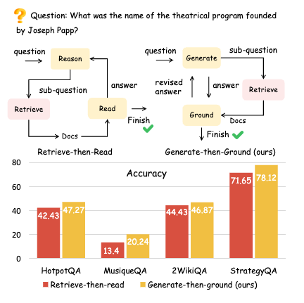
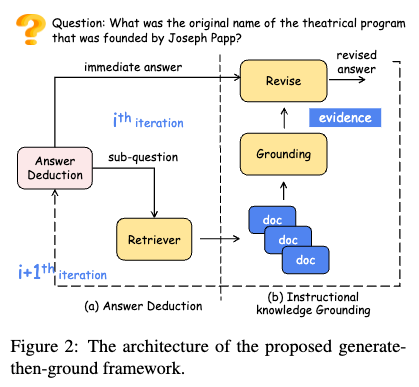

# GenGround: Generate-then-Ground 

Code for in Generate-then-Ground Retrieval-augmented Generation for Multi-hop Question Answering.

[](https://aclanthology.org/2024.acl-long.397/)

This project aims to explore a new Retrieval-augmentation Generation (RAG) method named Generate-then-Ground (GenGround). 
GenGround integrate the `parametric knowledge` of LLMs such as ChatGPT and GPT-4 and external knowledge from `retrieved document`.
<p align="center">
  
  
</p>

# News
- **[2024.09.16]** We release the main code for our proposed Generate-then-Ground method.
- **[2024.05.16]** Our paper has been accepted at the ACL 2024 main conference. See our paper at https://aclanthology.org/2024.acl-long.397/!


# Quick example
We provide an easy-to-use demo in `run.py`. Just run the following command.
```txt
BASE_URL=[OpenAI base url] python run.py
```

# Preliminaries

1. Set the OpenAI API key and base url in `src/genground.py` if you want to access these LLMs.
```python
base_url = ""
api_key = [
    'YOUR API key'
]
```

You can also directly set your base url as:
```txt
BASE_URL=[OpenAI base url] python run.py
```


2. Download the retrieval resource

We provide several retrieval strategies, such as oracle (directly give ground truth doc), simulation (mix ground truth doc with offline-retrieved docs) and online retrieval.
We use the `ColBERTv2.0` as retriever in our experiment. The corpus is `wikipedia2017` and `wikipedia2018` (for different evaluation datasets).

- The pretrained ColBERTv2.0 can be downloaded from `https://huggingface.co/colbert-ir/colbertv2.0`.
- The wikipedia2017 can be downloaded from `https://pan.baidu.com/s/19Lc3eVdoPjsCh609JyQ1kw?pwd=7457 ` (7457)
- The wikipedia2018 can be downloaded from `https://dl.fbaipublicfiles.com/dpr/wikipedia_split/psgs_w100.tsv.gz` (from DPR official Github).


3. Build the retrieval environment

We refer the code from previous work (`https://github.com/xsc1234/Search-in-the-Chain`) and official ColBERT Github (https://github.com/stanford-futuredata/ColBERT/tree/main)
- Index the corpus
```txt
python retrieval/index.py
```
(Be careful the resource path!)

- Deploy the retriever on your device to support retrieval.
```txt
python retrieval/server_retrieval.py
```


# Citation
Please cite our work if it is useful to your research. For any question, feel free to contact shizhl@mail.sdu.edu.cn.

```txt
@inproceedings{shi-etal-2024-generate,
    title = "Generate-then-Ground in Retrieval-Augmented Generation for Multi-hop Question Answering",
    author = "Shi, Zhengliang  and
      Zhang, Shuo  and
      Sun, Weiwei  and
      Gao, Shen  and
      Ren, Pengjie  and
      Chen, Zhumin  and
      Ren, Zhaochun",
    editor = "Ku, Lun-Wei  and
      Martins, Andre  and
      Srikumar, Vivek",
    booktitle = "Proceedings of the 62nd Annual Meeting of the Association for Computational Linguistics (Volume 1: Long Papers)",
    month = aug,
    year = "2024",
    address = "Bangkok, Thailand",
    publisher = "Association for Computational Linguistics",
    url = "https://aclanthology.org/2024.acl-long.397",
    pages = "7339--7353",
}
```